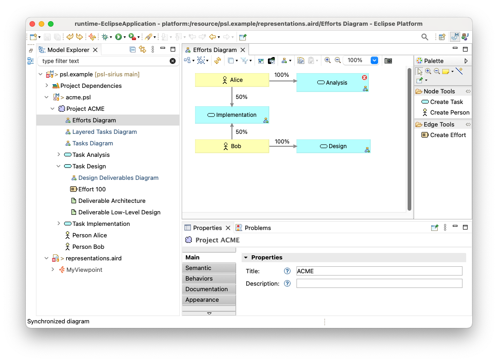

# PSL Sirius Editor

Eclipse Sirius editor for a simple [Project Scheduling Language (PSL)](psl/psl.emf). The editor demonstrates:

- Nodes, containers and element/relationsip-based edges
- Using multiple diagrams in the same model
- Custom icons and colours
- Layers
- [Model validation](https://eclipse.dev/epsilon/doc/articles/evl-emf-integration/) with the [Epsilon Validation Language](https://eclipse.dev/epsilon/doc/evl)

## How to run

- Clone this repository
- Install [Epsilon 2.5 using the Eclipse Installer](https://eclipse.dev/epsilon/download)
  - Prefer an embedded JRE 17
- Using the `Help -> Install New Software` menu in Eclipse, install the following features from the `https://download.eclipse.org/releases/2023-12` update site
  - Sirius Properties Views - Runtime Support
  - Sirius Properties Views - Specifier Support
  - Sirius Specifier Environment
- Import the following projects from this repository in your workspace
  - `psl`
  - `psl.edit`
  - `psl.editor`
  - `psl.design`
  - `psl.tests`
  - `psl.validation`
- Right-click on the `psl` project and select `Run As -> Eclipse Application`
- In the new Eclipse instance, import the following project from this repository
  - `psl.example`
- Switch to the `Modeling` perspective
- Explore the diagrams within `acme.psl`

## Screenshots

## Model validation

The `psl.validation` project contains a set of [constraints in EVL](psl.validation/psl.evl), which implement more complex validation logic that cannot be encoded in the metamodel (e.g. that the start month and the duration of a task are positive numbers, that all persons participate in at least one task). To run these constraints, introduce an error into one of your diagrams (e.g. make the start month of a task a negative number or add a person to the project that does not contribute to any task) and then select the `Diagram -> Validate` menu. An error/warning marker should be added to the offending element as shown below.

 

## Resources

The editor's [custom icons](psl.edit/icons/full/obj16) were borrowed from the [archi](https://github.com/archimatetool/archi/tree/master/com.archimatetool.editor/img) tool.
